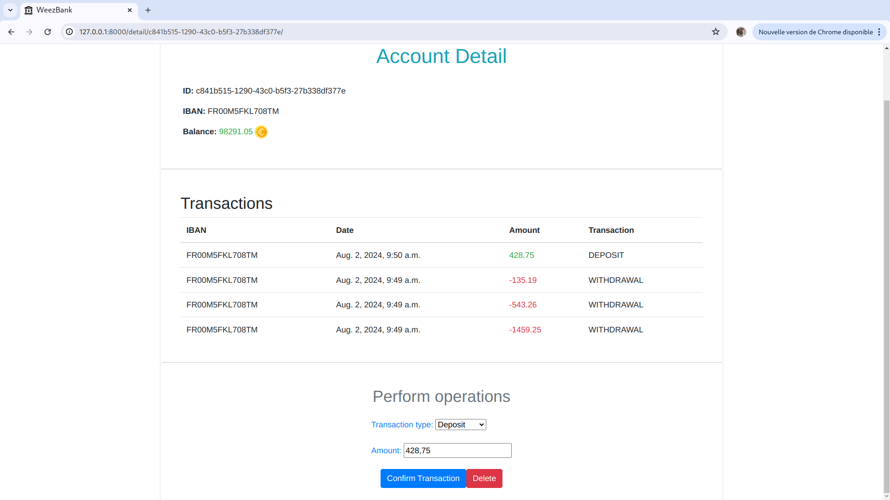
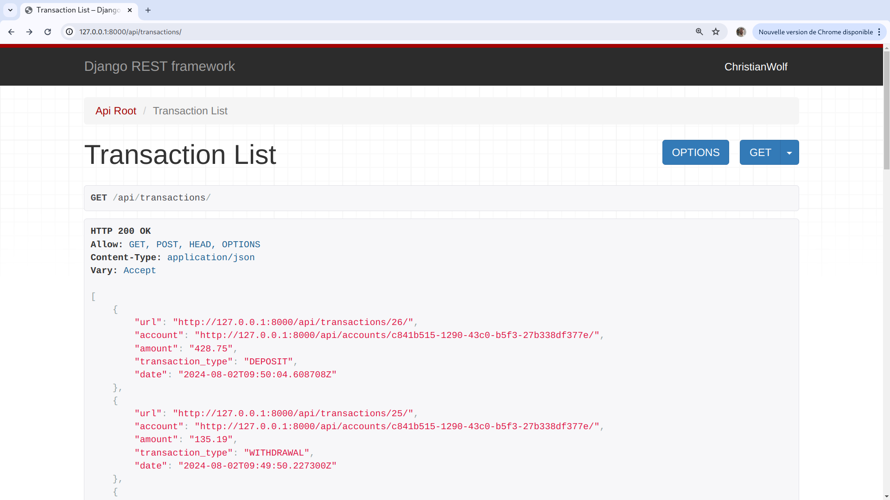

# Bank Account Management Application

This project is a basic Django application that simulates the creation and management of bank accounts. It is designed to showcase my use of Django for building web applications and the Django REST framework to build RESTful APIs.

## Features

- **User Registration**: Users can sign up and create an account using a registration form. This account is required to manage bank accounts.
- **Account Creation**: Authenticated users can create bank accounts with basic information such as account holder name, account type, and initial balance.
- **Account Management**: Users can view details of existing accounts, update account information, and manage account balances.
- **Transaction History**: Basic functionality to track deposits, withdrawals, and transfers between accounts.
- **User Authentication**: Users can log in and log out using Django's built-in authentication system.
- **RESTful API**: Provides endpoints for interacting with bank accounts, users, and customers via a RESTful API using Django REST Framework.

## Preview



## API Endpoints

The API provides the following endpoints:



### 1. **Accounts**

- **List Accounts**  
  `GET /api/accounts/`  
  Retrieves a list of all bank accounts.

- **Retrieve Account**  
  `GET /api/accounts/{id}/`  
  Retrieves details for a specific bank account by ID.

- **Create Account** - Django REST Framework 3.14.0
  `POST /api/accounts/`  
  Creates a new bank account.

- **Update Account**  
  `PUT /api/accounts/{id}/`  
  Updates an existing bank account by ID.

- **Delete Account**  
  `DELETE /api/accounts/{id}/`  
  Deletes a specific bank account by ID.

### 2. **Users**

- **List Users**  
  `GET /api/users/`  
  Retrieves a list of all users.

- **Retrieve User**  
  `GET /api/users/{id}/`  
  Retrieves details for a specific user by ID.

- **Create User**  
  `POST /api/users/`  
  Creates a new user.

- **Update User**  
  `PUT /api/users/{id}/`  
  Updates an existing user by ID.

- **Delete User**  
  `DELETE /api/users/{id}/`  
  Deletes a specific user by ID.

### 3. **Customers**

- **List Customers**  
  `GET /api/customers/`  
  Retrieves a list of all customers.

- **Retrieve Customer**  
  `GET /api/customers/{id}/`  
  Retrieves details for a specific customer by ID.

- **Create Customer**  
  `POST /api/customers/`  
  Creates a new customer.

- **Update Customer**  
  `PUT /api/customers/{id}/`  
  Updates an existing customer by ID.

- **Delete Customer**  
  `DELETE /api/customers/{id}/`  
  Deletes a specific customer by ID.

## Purpose

The main purpose of this application is to demonstrate my ability to use Django for web development. This project highlights my skills in:

- Setting up Django projects and applications.
- Creating models to represent business logic.
- Developing views and templates for user interaction.
- Implementing basic CRUD (Create, Read, Update, Delete) functionality.
- Using Django forms for data input and validation.
- Integrating Django's authentication system for user management.

## Requirements

- Python 3.12
- Django 5.0
- Django REST Framework 3.14.0
- SQLite (or any other supported database)
- Virtualenv (recommended for creating isolated environments)

## Setup Instructions

1. **Clone the repository**:

   ```bash
   git clone https://github.com/DevProjectEkla/django_bank_project.git
   cd django_bank_project
   ```

2. **Create and activate a virtual environment**:

   ```bash
   python -m venv env
   source env/bin/activate  # On Windows use `env\Scripts\activate`
   ```

3. **Install the dependencies**:

   ```bash
   pip install -r requirements.txt
   ```

4. **Apply the migrations**:

   ```bash
   python manage.py makemigrations
   python manage.py migrate
   ```

5. **Create a superuser** (to access the admin panel):

   ```bash
   python manage.py createsuperuser
   ```

6. **Run the development server**:

   ```bash
   python manage.py runserver
   ```

7. **Access the application**:

   - Visit `http://localhost:8000` in your browser to use the application.
   - Visit `http://localhost:8000/admin` to access the Django admin panel with the superuser account.

## Authentication System

This application uses Django's built-in authentication system to handle user registration, login, and logout. Here are the main features:

- **Signup**: Users can create a new account via the signup page at `/signup/`. A user account is required to create and manage bank accounts.
- **Login**: Users can log in via the login page at `/login/`.
- **Logout**: Users can log out via the logout page at `/logout/`.
- **Protected Views**: Certain views require the user to be authenticated. These views use the `@login_required` decorator to restrict access.

## Project Structure

- **bank_project**: Contains the auto-generated Django config for this project.
- **bank_account**: Contains the models, views, forms, and templates for managing user and bank accounts.
- **templates**: Contains HTML templates for rendering the user interface, including authentication templates.
- **static**: Stores static files like CSS, JavaScript, and images.

## Future Enhancements

- Developing a React client to interact with the API.
- Integrate more detailed transaction tracking and reporting features.
- Implement unit tests to ensure application reliability and correctness.

## License

This project is licensed under the MIT License. See the [LICENSE](https://github.com/DevprojectEkla/WeezBank/blob/main/LICENSE) file for more details.
